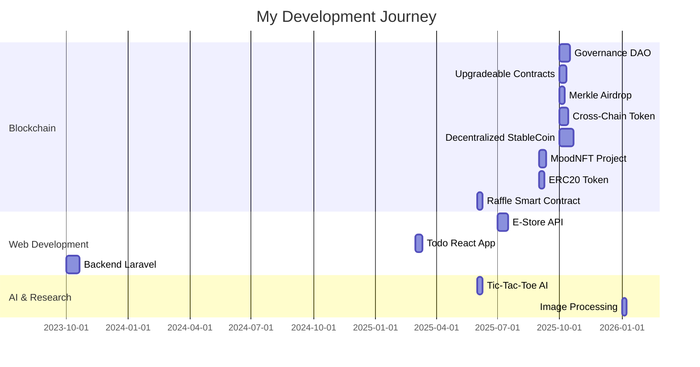

<div align="center">
  
# 👨‍💻 Belal Zedan

### Blockchain Developer | Full Stack Engineer | Smart Contract Architect

[](https://www.linkedin.com/in/belal-zedan-342aa1225)
[](mailto:belalzedan72@gmail.com)
[](https://github.com/BELALZEDAN)


</div>

---

## 🚀 About Me

I'm a passionate developer specializing in **Blockchain Technology** and **Full Stack Development**. With a strong foundation in smart contract development and web application architecture, I build robust, scalable, and secure solutions that bridge traditional web development with decentralized technologies.

- 🔗 Specialized in **Solidity**, **Smart Contracts**, and **DeFi Protocols**
- 💼 Experienced in building full-stack applications with **Laravel**, **Node.js**, and modern **JavaScript frameworks**
- 🎯 Committed to delivering high-quality, production-ready code with comprehensive testing
- 🌱 Continuously exploring **Web3**, **AI/ML**, and cutting-edge blockchain solutions
- 🤝 Open to collaborating on innovative blockchain and web development projects

---

## 🌟 Featured Projects

<table>
<tr>
<td width="50%">

### 🏛️ [Decentralized Governance DAO](https://github.com/BELALZEDAN/Decentralized-Governance-DAO)
A modular DAO exploring decentralized governance, proposal voting, and on-chain decision-making inspired by Vitalik's philosophy.

**Tech:** Solidity, Foundry, OpenZeppelin

</td>
<td width="50%">

### 💰 [Decentralized StableCoin](https://github.com/BELALZEDAN/Decentralized-StableCoin)
Exogenously collateralized stablecoin system inspired by MakerDAO's DAI with over-collateralization and algorithmic pegging.

**Tech:** Solidity, Chainlink, Foundry

</td>
</tr>
<tr>
<td width="50%">

### 🎁 [Advanced Merkle Airdrop](https://github.com/BELALZEDAN/Advanced-Merkle-Airdrop)
Sophisticated ERC20 airdrop with Merkle proofs, ECDSA signatures, and gasless claim capabilities.

**Tech:** Solidity, Merkle Trees, ECDSA

</td>
<td width="50%">

### 🌉 [Cross-Chain Rebase Token](https://github.com/BELALZEDAN/cross-chain-rebase-token)
Interoperable token with dynamic supply adjustment across multiple chains using Chainlink CCIP.

**Tech:** Solidity, Chainlink CCIP, Foundry

</td>
</tr>
<tr>
<td width="50%">

### 🎨 [MoodNFT](https://github.com/BELALZEDAN/moodnft-foundry)
Dynamic NFT collection with on-chain SVG storage and mood-flipping functionality.

**Tech:** Solidity, SVG, ERC721

</td>
<td width="50%">

### 🛒 [E-Store Backend API](https://github.com/BELALZEDAN/E-Store-Backend-API)
Scalable RESTful API for e-commerce with authentication, validation, and performance optimization.

**Tech:** Node.js, Express, MySQL

</td>
</tr>
</table>

<div align="center">
  
### [View All Projects →](https://github.com/BELALZEDAN?tab=repositories)

</div>

---

## 🛠️ Technical Arsenal

### Blockchain & Smart Contracts


### Frontend Development


### Backend Development


### Database & Tools


---

## 📊 GitHub Analytics

<div align="center">
  


</div>

<div align="center">
  


</div>

<div align="center">
  


</div>

---

## 📈 Contribution Activity

<div align="center">
  
[](https://github.com/ashutosh00710/github-readme-activity-graph)

</div>

---

## 💼 Core Competencies

<div align="center">

```javascript
const belalZedan = {
    title: "Blockchain & Full Stack Developer",
    location: "Syria 🇸🇾",
    expertise: {
        blockchain: [
            "Smart Contract Development",
            "DeFi Protocols & DAOs",
            "ERC20/ERC721 Token Standards",
            "Cross-Chain Solutions (CCIP)",
            "Upgradeable Contracts",
            "Security Auditing",
            "Merkle Trees & Cryptography"
        ],
        backend: [
            "RESTful API Design",
            "Database Architecture",
            "Authentication & Authorization",
            "Performance Optimization",
            "Server-Side Logic"
        ],
        frontend: [
            "Responsive Web Design",
            "Modern UI/UX",
            "State Management",
            "Component Architecture"
        ],
        tools: [
            "Foundry & Hardhat",
            "Git Version Control",
            "Testing & CI/CD",
            "Docker & Deployment"
        ]
    },
    currentFocus: [
        "Advanced DeFi Mechanisms",
        "Zero-Knowledge Proofs",
        "Layer 2 Scaling Solutions",
        "AI Integration in Web3"
    ],
    funFact: "I believe blockchain is the future of trust 🔐"
};
```

</div>

---

## 🎯 Current Focus

- 🔭 Building advanced **DeFi protocols** and **DAO governance systems**
- 🌐 Exploring **Layer 2 solutions** and **cross-chain interoperability**
- 📚 Deepening knowledge in **Zero-Knowledge Proofs** and **cryptographic primitives**
- 🤖 Integrating **AI/ML** capabilities into **Web3 applications**
- 🔒 Conducting **security audits** for smart contracts
- 📖 Contributing to **open-source blockchain projects**

---

## 🏆 Achievements & Highlights

<div align="center">

| 🎯 Metric | 📊 Value |
|-----------|----------|
| **Public Repositories** | 21+ |
| **Smart Contracts Deployed** | 15+ |
| **Languages Mastered** | 10+ |
| **Total Stars Earned** | 23+ |
| **Years of Experience** | 3+ |

</div>

---

## 🤝 Let's Collaborate

I'm always excited to work on innovative projects, especially in the blockchain and Web3 space. Whether you're building the next DeFi protocol, launching an NFT collection, or creating a decentralized application, I'd love to hear from you!

### 💡 Open to:
- 🔗 Blockchain & Smart Contract Development
- 🌐 Full Stack Web Applications
- 🤖 AI/ML Integration Projects
- 🔐 Security Audits & Code Reviews
- 📚 Technical Writing & Documentation
- 🎓 Mentoring & Knowledge Sharing

<div align="center">

[](mailto:belalzedan72@gmail.com)
[](https://www.linkedin.com/in/belal-zedan-342aa1225)

</div>

---

## 📚 Recent Projects Timeline



---

## 💭 Developer Wisdom

<div align="center">


</div>

---

## 📫 Get In Touch

<div align="center">

**"Building the decentralized future, one block at a time."**

[](https://github.com/BELALZEDAN/portfolio)
[](mailto:belalzedan72@gmail.com)

### ⭐ If you find my work interesting, consider giving a star to my repositories!


</div>

---

<div align="center">

### 💻 "Code is poetry, and blockchain is the future."


</div>
